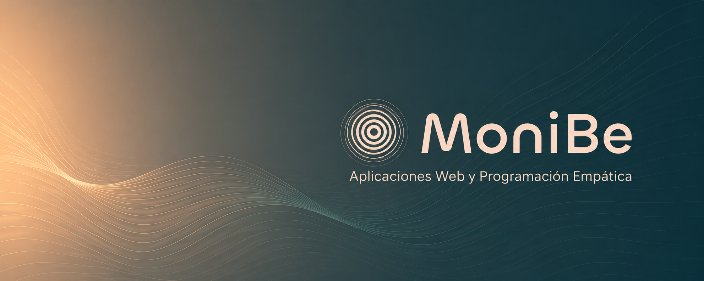

 

# Hola, soy Mónica 🌿

Desarrollo aplicaciones web con atención al detalle, cuidado por la experiencia de usuario y un punto de vista empático. Me importa tanto el código limpio como que lo que se construye tenga sentido para quien lo usa.

Actualmente disponible para proyectos de colaboración. Si tienes algo en mente, me alegra que estés aquí.

 

## Con qué trabajo

**Frontend**
HTML · CSS · JavaScript · TypeScript

**Backend & bases de datos**
PHP · MySQL · MongoDB · Firebase

**CMS & plataformas**
WordPress · WooCommerce

**Herramientas**
Git · GitHub · VS Code · Linux

 

## Algunos proyectos

| Proyecto | Descripción | Tecnologías |
|---|---|---|
| [Parkinson Granada](https://parkinson-granada.es/) | Web para una asociación de pacientes con Tienda Online | WordPress, UI/UX |
| [Restaurante Ramírez](https://restauranteramirez.es/) | Web para una cadena de restaurantes y diferentes opciones de reserva | WooCommerce, Hooks |
| [Solicitors Mazarrón](https://solicitorsmazarron.com/) | Web en inglés para despacho jurídico | PHP, SPA |
| [Notas estilo Matrix](https://monibe-code.github.io/mis-notas-matrix/) | App de notas con estética Matrix | HTML, CSS, JS |
| [MoniBe Portfolio](https://monibe.es) | Mi portfolio personal | HTML, CSS, JS, Firebase |

 

## Encuéntrame

 

---

Aplicaciones web · Programación empática 
